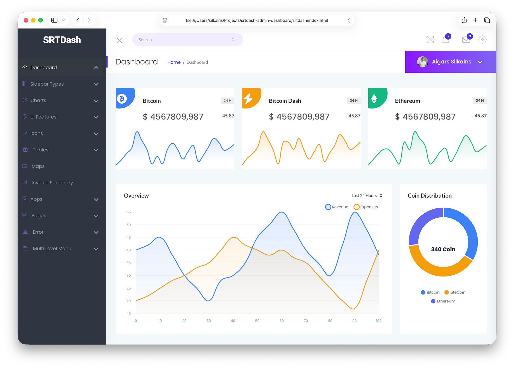
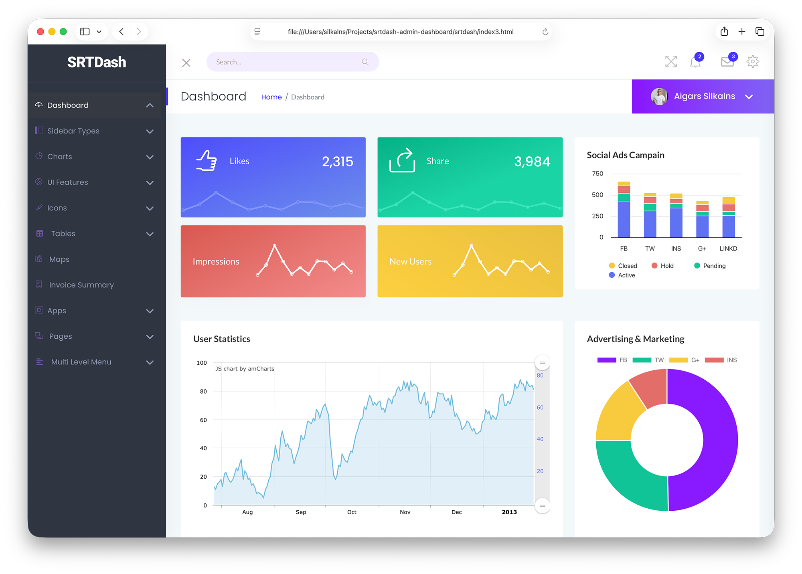

# SRTdash Admin Dashboard

A free, full-featured admin dashboard template built with **Bootstrap 5.3.8**, **HTML5**, **CSS3**, and **vanilla JavaScript**. No jQuery. No build tools. Just clean, modern code.

<p align="center">
  
</p>

<p align="center">
  
</p>

## Highlights

- **56 pages** — 4 dashboard variants, 9 app pages, 25+ UI components, auth flows, error pages
- **Zero dependencies on jQuery** — fully rewritten in vanilla JavaScript
- **Bootstrap 5.3.8** — latest stable, with Popper bundled
- **AVIF images** with `<picture>` JPG/PNG fallback for every image
- **Accessible** — skip links, `focus-visible`, `prefers-reduced-motion`
- **GA4 ready** — tracking placeholder on every page
- **No build step** — open any HTML file and go

## Quick Start

```bash
# Python
cd srtdash && python3 -m http.server 8000

# Node
npx http-server srtdash

# Then visit http://localhost:8000
```

There is a [starter template](srtdash/starter.html) for creating new pages — just copy it, update the `<title>` and `<meta description>`, and add your content inside `.main-content-inner`.

## Pages

### Dashboards

| Page | Description |
|------|-------------|
| [index.html](srtdash/index.html) | ICO / Crypto dashboard |
| [index2.html](srtdash/index2.html) | Ecommerce dashboard |
| [index3.html](srtdash/index3.html) | SEO / Marketing dashboard |
| [index3-horizontalmenu.html](srtdash/index3-horizontalmenu.html) | Horizontal menu variant |

### App Pages

| Page | Description |
|------|-------------|
| [calendar.html](srtdash/calendar.html) | Event calendar |
| [chat.html](srtdash/chat.html) | Chat / messaging interface |
| [email.html](srtdash/email.html) | Email inbox |
| [file-manager.html](srtdash/file-manager.html) | File manager |
| [invoice.html](srtdash/invoice.html) | Invoice template |
| [notifications.html](srtdash/notifications.html) | Notification center |
| [profile.html](srtdash/profile.html) | User profile |
| [settings.html](srtdash/settings.html) | Account settings |
| [widgets.html](srtdash/widgets.html) | Widget showcase |

### Charts

| Page | Description |
|------|-------------|
| [barchart.html](srtdash/barchart.html) | Bar charts (Chart.js, Highcharts, AmCharts) |
| [linechart.html](srtdash/linechart.html) | Line charts (Chart.js, Highcharts, ZingChart, AmCharts) |
| [piechart.html](srtdash/piechart.html) | Pie / doughnut charts (Chart.js, ZingChart, AmCharts, Highcharts) |
| [maps.html](srtdash/maps.html) | Google Maps |

### UI Components

Accordion, Alerts, Badges, Buttons, Button Groups, Cards, Dropdowns, Grid, List Groups, Media Objects, Modals, Pagination, Popovers, Pricing Tables, Progress Bars, Tabs, Typography

### Tables & Forms

| Page | Description |
|------|-------------|
| [datatable.html](srtdash/datatable.html) | Interactive data tables (Simple-DataTables) |
| [table-basic.html](srtdash/table-basic.html) | Basic Bootstrap tables |
| [table-layout.html](srtdash/table-layout.html) | Table layout variations |
| [form.html](srtdash/form.html) | Form elements and validation |

### Icons

| Page | Description |
|------|-------------|
| [fontawesome.html](srtdash/fontawesome.html) | Font Awesome 7.1 icon showcase |
| [themify.html](srtdash/themify.html) | Themify Icons showcase |

### Authentication & Error

Login (3 variants), Register (4 variants), Forgot Password, Reset Password, Screen Lock (2 variants), 401, 403, 404, 500

## Tech Stack

| Library | Version | Source |
|---------|---------|--------|
| Bootstrap | 5.3.8 | Vendor (bundle with Popper) |
| MetisMenuJS | 1.4.0 | Vendor |
| Swiper | 12.1.0 | Vendor |
| Simple-DataTables | 10.x | CDN |
| Chart.js | 4.5.1 | CDN |
| Highcharts | 12.5.0 | CDN |
| ZingChart | 2.9.16 | CDN |
| Font Awesome | 7.1.0 Free | Vendor |
| Themify Icons | -- | Vendor |
| Google Fonts | -- | CDN (Lato, Poppins) |

## Project Structure

```
srtdash/
├── assets/
│   ├── css/          # Bootstrap 5.3.8, Font Awesome 7.1, template styles
│   ├── js/           # Vanilla JS — scripts.js, chart files, vendor libs
│   ├── fonts/        # Font Awesome + Themify icon fonts
│   └── images/       # AVIF + JPG/PNG fallback images
├── index.html        # Main dashboard
├── starter.html      # Blank page template
└── *.html            # All other pages
documentation/        # Standalone docs site (separate)
```

## Changelog

See [CHANGELOG.md](CHANGELOG.md) for the full version history.

## Authors

[Colorlib](https://colorlib.com)

## Related Resources

- [Bootstrap Dashboards](https://colorlib.com/wp/free-bootstrap-admin-dashboard-templates/)
- [Angular Dashboards](https://colorlib.com/wp/angularjs-admin-templates/)
- [Free Admin Dashboards](https://colorlib.com/wp/free-html5-admin-dashboard-templates/)
- [Bootstrap Templates](https://colorlib.com/wp/templates/)
- [WordPress Themes](https://colorlib.com/wp/free-wordpress-themes/)

## License

SRTdash is licensed under The MIT License (MIT). You can use, copy, modify, merge, publish, distribute, sublicense, and/or sell copies of the final products. You must always credit Colorlib as the original author.
